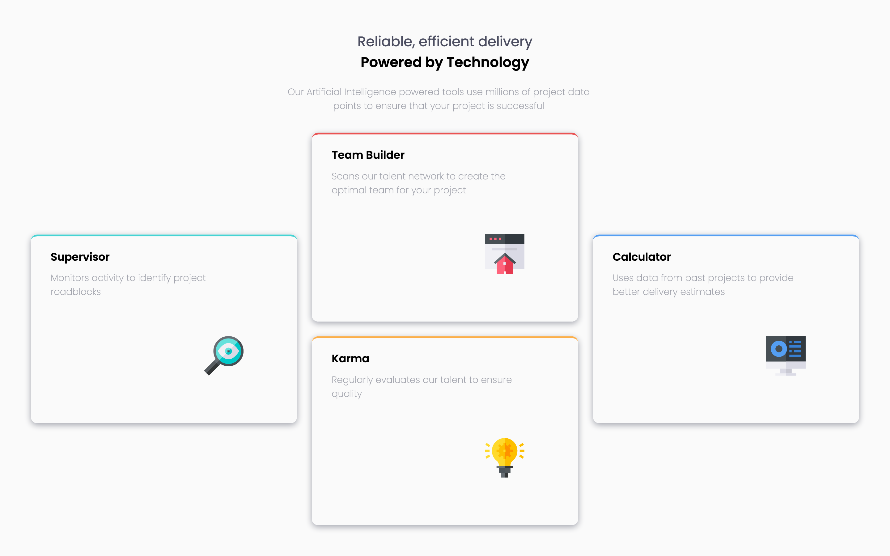

# Frontend Mentor - Four card feature section solution

This is a solution to the [Four card feature section challenge on Frontend Mentor](https://www.frontendmentor.io/challenges/four-card-feature-section-weK1eFYK). Frontend Mentor challenges help you improve your coding skills by building realistic projects.

## Table of contents

- [Overview](#overview)
  - [The challenge](#the-challenge)
  - [Screenshot](#screenshot)
  - [Links](#links)
- [My process](#my-process)
  - [Built with](#built-with)
  - [What I learned](#what-i-learned)
  - [Continued development](#continued-development)
  - [Useful resources](#useful-resources)
- [Author](#author)

**Note: Delete this note and update the table of contents based on what sections you keep.**

## Overview

### The challenge

Users should be able to:

- View the optimal layout for the site depending on their device's screen size

### Screenshot




### Links

- Live Site URL: [four-card-feature-section-component](https://four-card-feature-section-component.vercel.app/)

## My process

### Built with

- Semantic HTML5 markup
- CSS custom properties
- Flexbox
- CSS Grid
- Mobile-first workflow

**Note: These are just examples. Delete this note and replace the list above with your own choices**

### What I learned

```css
.proud-of-this-css-on-the-card-class {
	.card {
		display: grid;
		grid-template-columns: repeat(3, 1fr);
		grid-template-rows: repeat(5, 1fr);
		justify-content: center;
		align-content: center;
		min-height: 100vh;
	}
}
```

### Continued development

- learning about css grid area
- improving on styling text elements

### Useful resources

- [A Complete Guide to CSS Grid](https://css-tricks.com/snippets/css/complete-guide-grid/#prop-place-self) - This helped me for setting both the parent container and child items grid .

- [The EASIEST way to get started with CSS GRID](https://www.youtube.com/watch?v=_lEkD8IGkwo) - This is an amazing video which helped me finally understand css grid layour. I'd recommend it to anyone still learning grid concept.

## Author

- Frontend Mentor - [@mayor-creator](https://www.frontendmentor.io/profile/mayor-creator)
- Twitter - [@mayor_creator](https://www.twitter.com/mayor_creator)
